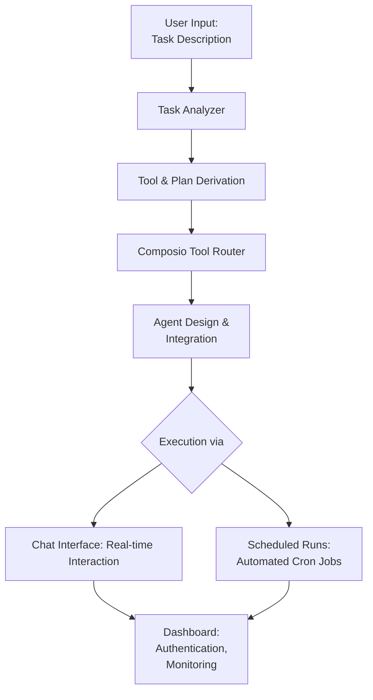

# Composio Agent Builder

##  Table of Contents
- [Overview](#Overview)
- [Core Features](#Core-Features)
- [Architecture Overview](#Architecture-Overview)
- [Authentication](#Authentication)
- [Dashboard Modules](#Dashboard-Modules)
- [Tech Stack](#Tech-Stack)
- [Example Use Case](#Example-Use-Case)
- [Installation & Setup](#Installation-amp-Setup)
  - [Clone the repository](#Clone-the-repository)
  - [Environment Variables](#Environment-Variables)
  - [Docker Setup](#Docker-Setup)
  - [Manual Setup](#Manual-Setup)
    - [Backend Setup](#Backend-Setup)
    - [Frontend Setup (dashboard)](#Frontend-Setup-dashboard)

##  Overview
This project enables **autonomous task execution** through an AI-powered agent that can **analyze a user’s task description**, **derive the required tools and toolkits**, **design an execution plan**, and **implement it automatically** using **Composio’s [Tool Router](https://docs.composio.dev/docs/tool-router/quick-start)**.

It provides two major modes of interaction:
1. **Chat Interface** – Interactively communicate with the agent to accomplish tasks.
2. **Scheduled Agent Runs (Cron)** – Automate workflows to run at specified times.

All settings, authentications, and configurations are managed via a **user-friendly dashboard**.


##  Core Features

###  1. Task Understanding & Planning
- The user inputs a **task description**.
- The system analyzes the task to:
  - Identify relevant **tools** and **toolkits**.
  - Design a **step-by-step plan** for implementation.

###  2. Dynamic Tool Integration via Composio
- The project leverages **[Composio](https://www.composio.dev/)**’s **Tool Router** to:
  - Integrate and manage all required tools dynamically.
  - Route execution through appropriate services.
- The agent automatically connects and executes using authenticated tools.

###  3. Chat Interface
- Chat directly with your intelligent agent.
- Discuss, modify, and monitor tasks in real time.
- Great for debugging or performing one-off task executions.

###  4. Scheduled Agent Runs (Cron Jobs)
- Set **time-based workflows** to automate task execution.
- Ideal for repetitive or recurring operations.

###  5. Assistant Dashboard
- Unified control panel for:
  - Chat Interface
  - Scheduled Agent Runs
  - Tool Authentication & Access Management
- Provides seamless configuration and monitoring.

### 6. Exporting and Importing Agents
- Easily import agents from json format.
- Share your custom-built agents with others by exporting them.


##  Architecture Overview




##  Authentication

- Each integrated tool requires **user authentication**.
- Authentication is handled securely through the **assistant dashboard**.
- Once authorized, the agent gains controlled access to perform operations using that tool.


##  Dashboard Modules

| Module | Description |
|--------|--------------|
| **Chat Interface** | Converse with the agent to execute or test tasks in real-time. |
| **Scheduled Runs** | Configure cron-like schedules for periodic task execution. |
| **Tool Authentication** | Securely connect third-party tools. |


##  Tech Stack
- **LLM / AI Frameworks:** OpenAI / Langgraph framework
- **Tool Integration:**  Composio Python SDK
- **Backend:** Python / FastAPI
- **Frontend:** React / Next.js
- **Scheduling:** Cron
- **Database:** SQLite


##  Example Use Case

### Task Description:
> “Fetch latest news of the given company and draft the summary in google docs”

### Created Plan (using Tool Router):

1. Use the `COMPOSIO_SEARCH_NEWS` tool to search for the most recent news articles related to the given company. Use a relevant time filter such as the past day or week to ensure up-to-date news.
2. Analyze and summarize the retrieved news articles to create a clear, informative summary.
3. Use the `GOOGLEDOCS_CREATE_DOCUMENT_MARKDOWN` tool to create a new Google Docs document titled as specified by the user, and populate it with the summary content in markdown format.

**Instructions**: Strictly follow the above plan. Use only the specified tools for searching news and creating the Google Docs document. Request user clarification only if completely blocked due to missing or unclear information.

**Tools**: ["COMPOSIO_SEARCH_NEWS", "GOOGLEDOCS_CREATE_DOCUMENT_MARKDOWN"]


## Installation & Setup

### Clone the repository
```bash
git clone https://github.com/OSSML/Composio_Agent_Builder.git
cd Composio_Agent_Builder
```
### Environment Variables

Copy .env.example to .env and configure values:
- Get your OpenAI api key from [here](https://platform.openai.com/api-keys)
- Get your Composio api key from [here](https://platform.composio.dev/?next_page=/settings)

```
cp .env.example .env
```

```bash
COMPOSIO_API_KEY= "YOUR_API_KEY"
OPENAI_API_KEY= "YOUR_API_KEY"

# ----- Optional ENV variables -----

## Optional Database file path (Must be empty for docker build)
## Saves the .db file in the project root directory if not specified.
## Format f"sqlite+aiosqlite:///{.db posix file path}"
# DATABASE_URL=...

### Logging configuration
## default "LOCAL". Anything other than "LOCAL" or "DEVELOPMENT" will output structured logging (suitable for filtering) instead of string logging
# ENV_MODE=...
## default "INFO"
# LOG_LEVEL=...

## Optional Langsmith tracing
# LANGSMITH_TRACING=true
# LANGSMITH_ENDPOINT=https://api.smith.langchain.com
# LANGSMITH_API_KEY=...
# LANGSMITH_PROJECT=composio-agent-builder

```

## Docker Setup
```bash!
docker-compose up
```

## Manual Setup

### Backend Setup
```
cd backend
```

#### Using uv (recommended)

```bash
# Install dependencies
uv sync
# Run the Backend
uv run main.py
```

#### Using pip

```bash
# creating a virtual environment
python -m venv env
# Activation for linux
source env/Scripts/activate
# Activation for windows
env/Scripts/activate.ps1

# Install dependencies
pip install -r pyproject.toml

# Run the Backend
python main.py
```

### Frontend Setup (dashboard)
```bash
# In new terminal
cd frontend
npm install
npm run dev
````

Then open the dashboard at:
 `http://localhost:3000`

The project comes with 3 default agents to experiment with.


# License
Apache 2.0 License - see [LICENSE](LICENSE) file for details.
